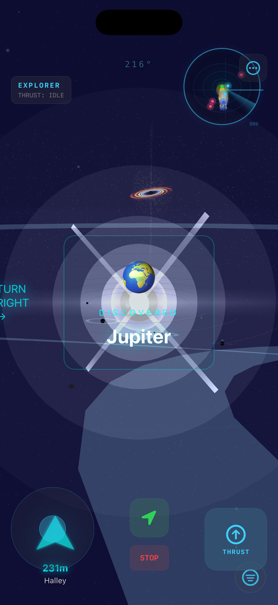
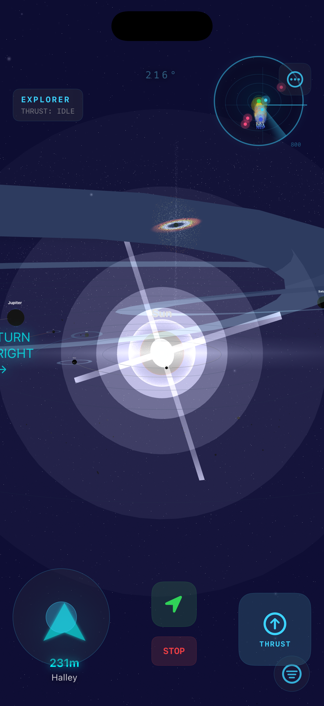
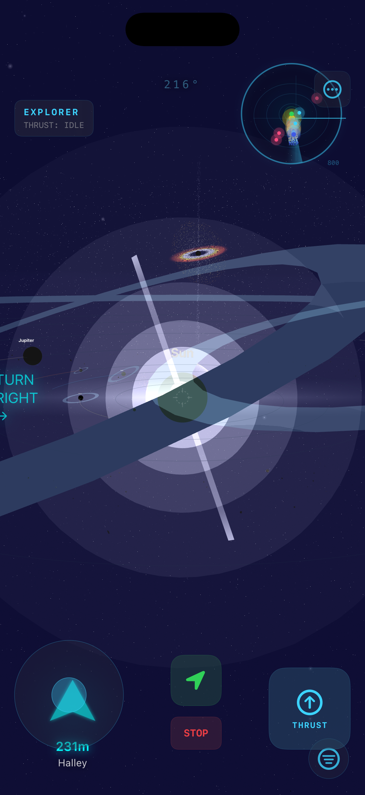
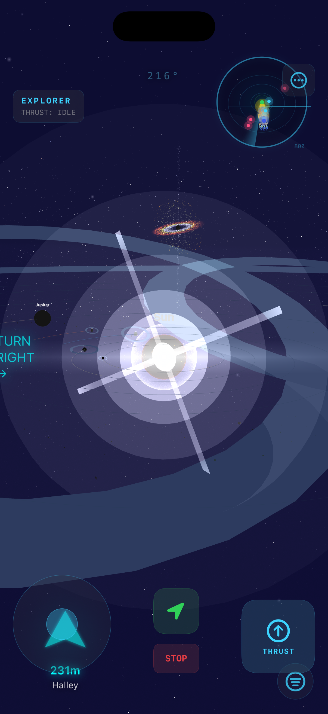

<div align="center">

# RealTime Fidget

### A photoreal real-time solar system explorer for iOS.

Fly through the entire solar system on your phone — every planet, moon, ring system, and the Sun rendered with real NASA imagery, true-3D atmospheric scattering, and cinematic post-processing.



[]()
[]()
[]()
[]()

</div>

---

## What it is

A SwiftUI iOS app wrapping a Three.js + WebGL galaxy renderer in a `WKWebView`. The Swift side handles touch (joystick, thrust, picker), the JavaScript side renders the entire solar system to your screen at 60 fps with real planet textures, real day/night terminators, real ring systems, and an HDR pipeline that bloom-floods the Sun like staring through a telescope.

## Features

- 🌍 **Photoreal Earth** — NASA Blue Marble (8K daymap) + Black Marble (city lights at night) blended through a custom shader with sunset terminator glow, ocean specular highlights, a real MODIS cloud composite layer, and 8K elevation-driven terrain relief along the terminator
- ☀️ **Living Sun** — Solar System Scope albedo modulated by procedural FBM convection, granulation, sunspots, and active regions, with limb prominences, CMEs, and solar wind that reveal themselves as you fly close
- 🪐 **Real planet textures** — every body in the catalog: Mercury, Venus, Mars, Jupiter (4K), Saturn (4K), Uranus, Neptune, the Moon, and Pluto, with bump maps where they help
- 💍 **Physically-lit rings** — real NASA ring imagery with alpha-masked gaps, sunlit/backlit faces, the planet's shadow sweeping across the ring plane, and the rings' shadow band striping Saturn's cloud tops
- 🌑 **Real shadows & eclipses** — analytic soft shadows between bodies: solar eclipses on Earth, lunar eclipses on the Moon, Galilean moons dotting Jupiter with transit shadows
- 🌕 **Seven moons** — Luna plus volcanic Io, ice-cracked Europa, Ganymede, Callisto, orange-hazed Titan, and Enceladus with erupting south-pole geysers
- 🌌 **Real Milky Way sky** — 8K panorama as the actual skybox *and* PMREM-prefiltered image-based lighting on every surface
- 🎬 **Cinematic pipeline** — EffectComposer with HDR bloom, screen-space god rays, ACES Filmic tonemapping, gamma-correct sRGB output, custom Rayleigh-Mie atmospheric scattering, optional LUT grading
- 🕐 **Real ephemeris + time control** — planets start where they actually are today; a TIME pill runs orbits at 1×–1000× or pauses them
- 🔊 **Procedural soundscape** — synthesized space drone, throttle-following engine rumble, a shimmer near the Sun, sub-bass dread near the black hole (no audio files; space purists can switch it off)
- 🏆 **Missions** — Ring Runner, Sungrazer, Edge of the Abyss, the Grand Tour and more, with progress saved between flights
- 🚀 **Direct touch flight** — analog joystick + thrust trigger, or one-tap fly-to-nearest-planet
- 📷 **Photo Mode** — instant UI hide for clean cinematic captures

## Screenshots

<table>
<tr>
  <td></td>
  <td></td>
</tr>
<tr>
  <td align="center"><sub>Initial view — Earth front of frame, Saturn's ring crossing the sky</sub></td>
  <td align="center"><sub>Sun bloom drowning the viewport, Saturn ringline overhead</sub></td>
</tr>
<tr>
  <td></td>
  <td></td>
</tr>
<tr>
  <td align="center"><sub>Mid-orbit — Saturn's rings cutting through the sun's halo</sub></td>
  <td align="center"><sub>Cinematic wide — Jupiter (labeled) and the inner system</sub></td>
</tr>
</table>

## Tech stack

| Layer | What |
|------|------|
| App shell | SwiftUI + `WKWebView` |
| Renderer | Three.js r150 as ES modules via importmap (WebGL2) — includes `EffectComposer`, `UnrealBloomPass` |
| Materials | `MeshStandardMaterial` + custom `ShaderMaterial` for Earth/Sun/rings |
| Color pipeline | Linear-sRGB workflow, ACES Filmic tonemapping, gamma-correct composer output |
| Lighting | Zero-decay solar point light + analytic eclipse/ring shadows in-shader, PMREM Milky Way IBL |
| Post | Bloom → screen-space god rays → LUT/color correction → linear→sRGB |
| Audio | Procedural WebAudio (`AudioEngine.js`) — oscillators + filtered noise, no assets |
| Bridge | `WKScriptMessageHandler` + `evaluateJavaScript` two-way nav |

## Build & run

Requires Xcode 26+ and an iOS 26 device or simulator.

```bash
git clone https://github.com/nicedreamzapp/RealTime-Fidget.git
cd "RealTime-Fidget"
open "RealTime Fidget.xcodeproj"
```

Hit ⌘R. The texture pack ships in `textures/` (~24 MB) and is bundled automatically via a folder reference. JS files are individual Xcode file references — when adding a new one, add it to the project's Resources phase too. Three.js itself loads from jsDelivr, so first launch needs a network connection.

## Project layout

```
RealTime Fidget/                      # SwiftUI app shell (joystick, picker, audio)
  ContentView.swift
  WorkingPortalWebView.swift
  SpaceNavigationController.swift
  ...

main.js                               # Three.js scene, planet wiring, ephemeris, fly-to logic
Planet.js                             # Planet rendering + eclipse/ring shadow shaders
Moons.js                              # Io, Europa, Ganymede, Callisto, Titan, Enceladus
Star.js                               # Sun rendering (corona, prominences, CMEs, photoreal)
RendererCore.js                       # WebGL renderer, ACES, Milky Way skybox + IBL
AudioEngine.js                        # Procedural WebAudio soundscape
Missions.js                           # Exploration challenges + toasts
Starfield.js / Nebula.js / BlackHole.js / Comet.js / ...

textures/                             # NASA + Solar System Scope bundle
  earth/  sun/  mercury/  venus/  mars/
  jupiter/  saturn/  uranus/  neptune/
  moon/  pluto/  starfield/
```

## Credits & attributions

This project bundles freely-licensed astronomical imagery from:

- **NASA Visible Earth** ([visibleearth.nasa.gov](https://visibleearth.nasa.gov)) — Blue Marble Next Generation, Black Marble city lights, MODIS cloud composite. Public domain.
- **Solar System Scope** ([solarsystemscope.com/textures](https://www.solarsystemscope.com/textures)) — Sun surface albedo, 8K Milky Way panorama, 4K Jupiter/Saturn, 2K Uranus/Neptune, Saturn ring alpha. CC-BY 4.0.
- **threex.planets** ([github.com/jeromeetienne/threex.planets](https://github.com/jeromeetienne/threex.planets)) — Mercury, Venus, Mars, Jupiter, Saturn (+ rings), Uranus (+ rings), Neptune, Moon, Pluto sphere maps and bump maps. Public domain.

Built on [Three.js](https://threejs.org/) by [@mrdoob](https://github.com/mrdoob) and contributors.

## License

MIT — see [LICENSE](LICENSE).

---

<div align="center">
<sub>Made with WebGL, real photons, and a lot of Cmd-R</sub>
</div>
