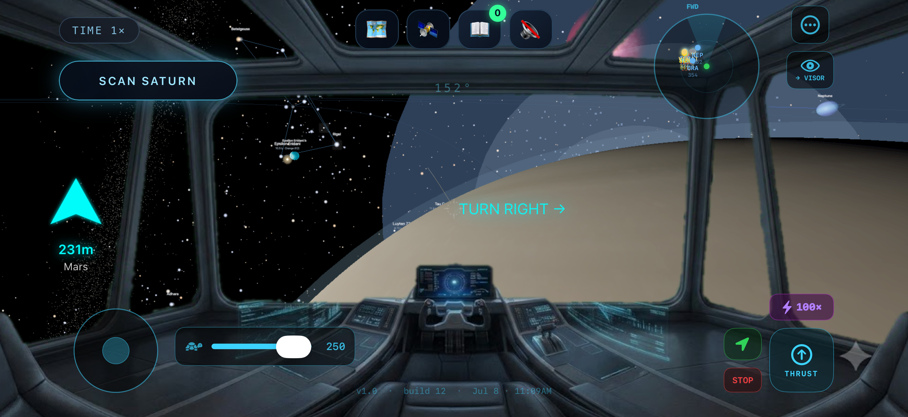
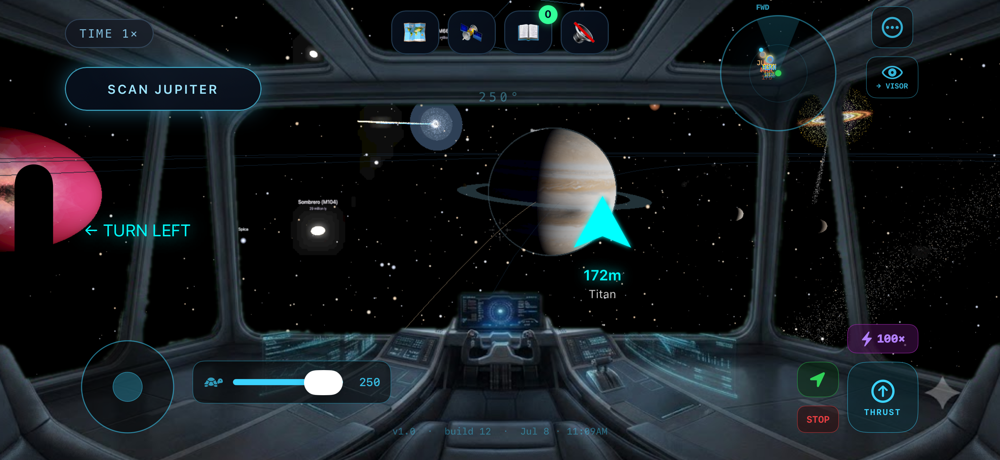
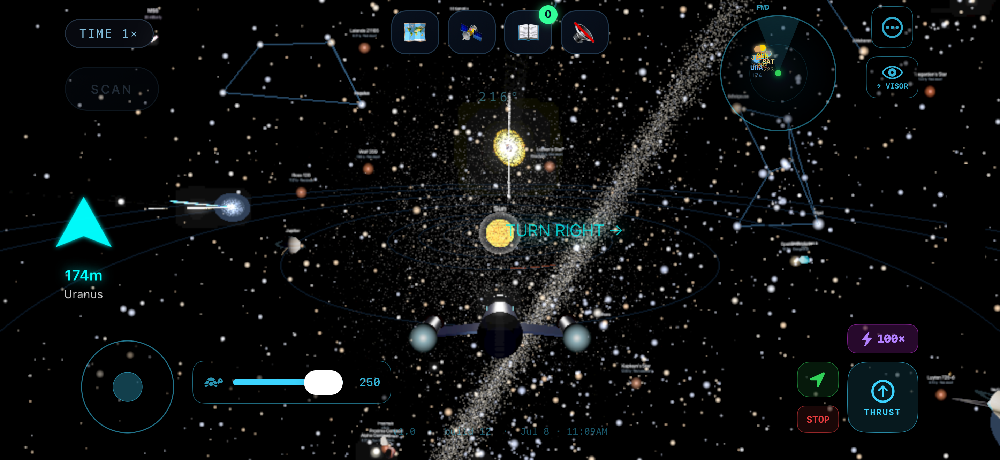
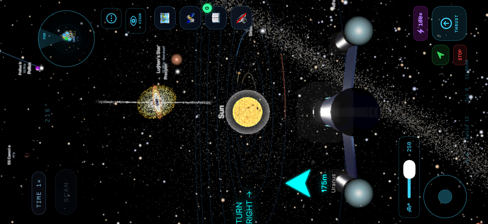

# RealTime Space

### A photoreal real-time solar system explorer.

Fly through the entire solar system on your phone — every planet, moon, ring system, and the Sun rendered with real NASA imagery, true-3D atmospheric scattering, and cinematic post-processing.

###   

**Download RealTime Space on [iPhone](https://apps.apple.com/us/app/realtime-space/id6788646103) or [Android](https://play.google.com/store/apps/details?id=com.nicedreamz.realtimespace)** — free for 60 days, then one $1.99 unlock keeps the universe forever.

   

**In one sentence:** RealTime Space is a phone app that lets you fly a ship through a 3D model of the solar system, rendered live in WebGL inside a native iOS or Android shell. It is shipped and live on both the App Store and Google Play.

This repo holds both platforms of RealTime Space, cleanly separated:

## 📱 iOS

SwiftUI + `WKWebView` wrapping a Three.js/WebGL solar system renderer. Full source, Xcode project, and textures live in [`ios/`](ios/).

**Status:** ✅ [Live on the App Store](https://apps.apple.com/us/app/realtime-space/id6788646103). Version 1.3.2 (build 23) in the Xcode project.

## 🤖 Android

The Android port — a WebView shell around the same renderer, with all web assets bundled. Source in [`android/`](android/).

**Status:** ✅ [Live on Google Play](https://play.google.com/store/apps/details?id=com.nicedreamz.realtimespace). Version 1.5 (versionCode 9) in [`android/app/build.gradle.kts`](android/app/build.gradle.kts).

## 🛠️ What I built (Matt Macosko)

- **The 3D renderer** in JavaScript on top of three.js: planets with atmosphere and ring shadows ([`ios/Planet.js`](ios/Planet.js)), moons ([`ios/Moons.js`](ios/Moons.js)), the Sun and stars ([`ios/Star.js`](ios/Star.js)), orbits ([`ios/OrbitalMechanics.js`](ios/OrbitalMechanics.js)), flight physics ([`ios/NavigationPhysics.js`](ios/NavigationPhysics.js)), nebulae, asteroid belt, black hole, warp effect and HUD, wired together in [`ios/main.js`](ios/main.js) and [`ios/RendererCore.js`](ios/RendererCore.js).
- **The "Codex" deep-space layer** in [`ios/codex/`](ios/codex/): constellations, exoplanets, galaxies, a cockpit view, and a live-data panel ([`ios/codex/LiveData.js`](ios/codex/LiveData.js)) that shows the real current ISS position and today's near-Earth asteroids.
- **The iOS app shell** in SwiftUI: the web view and JS bridge ([`ios/WorkingPortalWebView.swift`](ios/WorkingPortalWebView.swift), [`ios/GalaxyBridge.swift`](ios/GalaxyBridge.swift)), a custom `appassets://` scheme so WebGL can load bundled textures ([`AppAssetSchemeHandler.swift`](ios/RealTime%20Fidget/AppAssetSchemeHandler.swift)), the native radar ([`ios/SimpleRadarView.swift`](ios/SimpleRadarView.swift)) and audio ([`ios/AudioManager.swift`](ios/AudioManager.swift)).
- **The Android port** in Kotlin + Jetpack Compose: [`MainActivity.kt`](android/app/src/main/java/com/nicedreamz/realtimespace/MainActivity.kt), a JS bridge that mimics the iOS message handler ([`WebBridge.kt`](android/app/src/main/java/com/nicedreamz/realtimespace/WebBridge.kt)), and a Compose port of the iOS radar ([`RadarView.kt`](android/app/src/main/java/com/nicedreamz/realtimespace/RadarView.kt)).
- **The paywall on both stores**: a 60-day free trial, then a one-time non-consumable unlock (not a subscription), plus gift codes checked against SHA-256 digests. StoreKit 2 on iOS ([`StoreManager.swift`](ios/RealTime%20Fidget/StoreManager.swift), trial date kept in the Keychain so a reinstall does not reset it) and Google Play Billing on Android ([`StoreManager.kt`](android/app/src/main/java/com/nicedreamz/realtimespace/StoreManager.kt)).

**Upstream, not mine:** [three.js](https://github.com/mrdoob/three.js) (r150, bundled at [`ios/textures/lib/three.bundle.js`](ios/textures/lib/)) does the WebGL work. Planet imagery comes from NASA and other texture sets listed in [CREDITS.md](CREDITS.md) and [THIRD_PARTY_NOTICES.md](THIRD_PARTY_NOTICES.md). Live data comes from [wheretheiss.at](https://wheretheiss.at) and NASA's NeoWs API.

## 🚀 Building it yourself

- **iOS:** open [`ios/RealTime Fidget.xcodeproj`](ios/RealTime%20Fidget.xcodeproj) in Xcode (the project still uses its old working name, "RealTime Fidget"). The deployment target is iOS 26.0, so you need an Xcode with the iOS 26 SDK. [`ios/Products.storekit`](ios/Products.storekit) lets you test the unlock locally without App Store Connect.
- **Android:** from [`android/`](android/), run `./gradlew assembleDebug` (JDK 17, compileSdk 36, minSdk 26). A release build reads signing keys from `android/keystore.properties`, which is not in the repo, so only debug builds work out of the box.
- No build step for the web renderer: the HTML, JS and textures are bundled into each app as plain files.

## ⚠️ Known limits

- The iOS and Android web assets are two separate copies ([`ios/`](ios/) and [`android/app/src/main/assets/web/`](android/app/src/main/assets/web/)), kept in step by hand. Several files (for example `main.js`, `Planet.js`, `index.html`) currently differ between them, so the two apps are not guaranteed to be identical.
- The live-data panel needs a network connection. Offline it falls back to the last good data or a "no signal" message.
- There are no meaningful automated tests; the Xcode test targets are the default templates.

## Links

- App Store: https://apps.apple.com/us/app/realtime-space/id6788646103
- Google Play: https://play.google.com/store/apps/details?id=com.nicedreamz.realtimespace
- Product page: https://nicedreamzwholesale.com/software/realtime-space/
- Questions or bugs? **info@nicedreamzwholesale.com**

## License

MIT, see [LICENSE](LICENSE). Bundled textures keep their own licenses, listed in [THIRD_PARTY_NOTICES.md](THIRD_PARTY_NOTICES.md).
